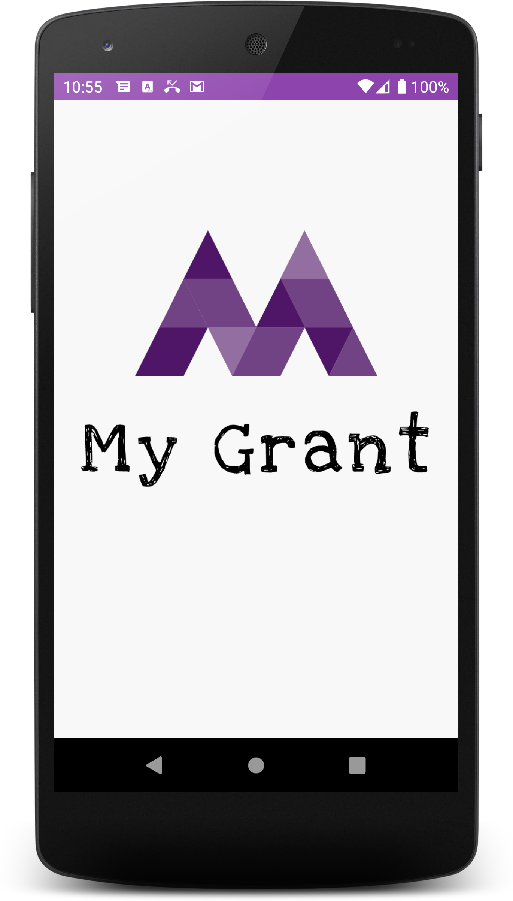
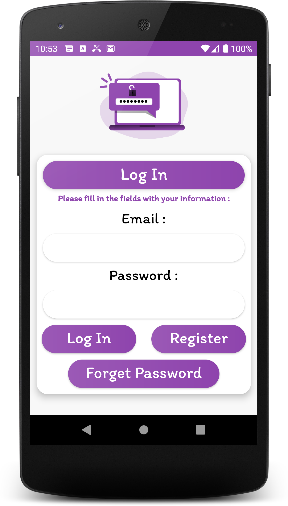
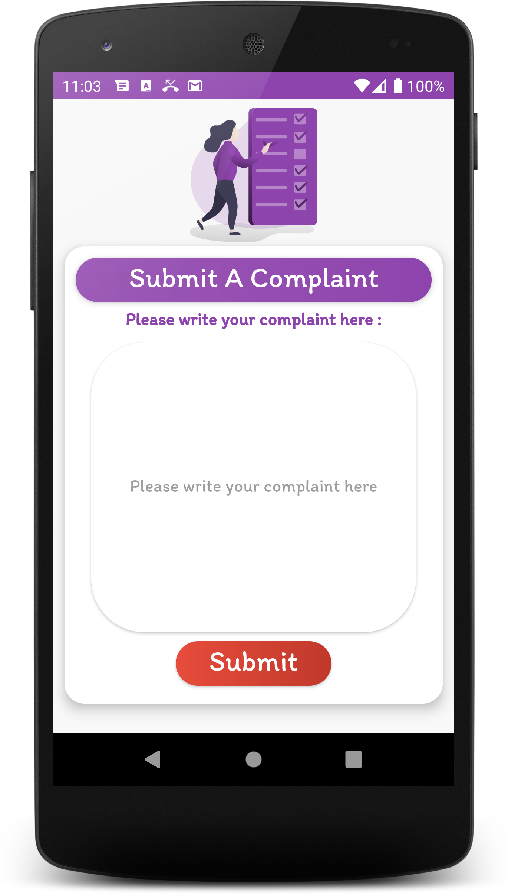
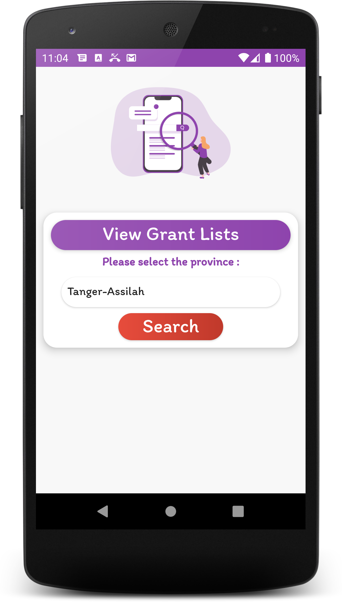
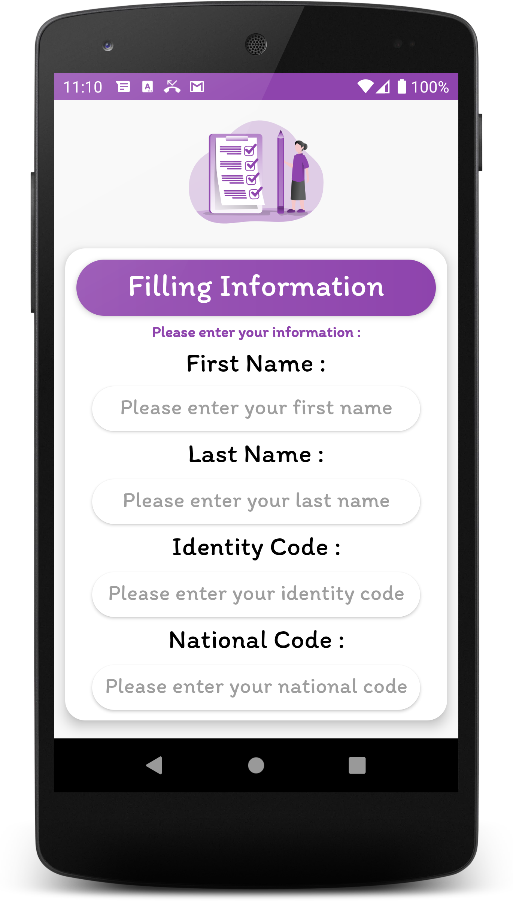
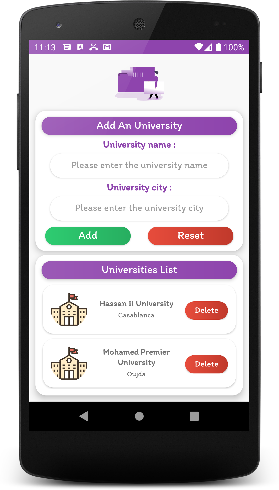
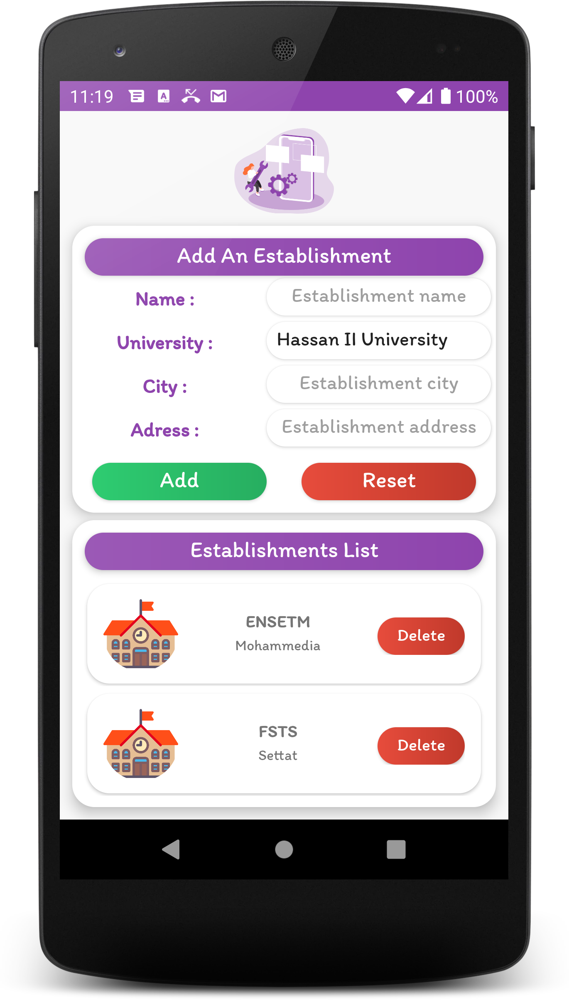

# MyGrant
> An Android application to manage student grants


## Prerequisites

- Install Android Studio :
> From : [Android Studio](https://developer.android.com/studio)

- PostgreSQL 13 :
> Using [Docker](https://www.docker.com) :
```shell
docker pull postgres:13
docker run --name postgresql-container -p 5432:5432 -e POSTGRES_PASSWORD=postgres -d postgres
docker ps
```

- Create the database using the queries from the file : database.sql


- Edit app/src/main/res/values/settings.xml file :

```xml
<?xml version="1.0" encoding="utf-8"?>
<resources>
    <string name="database_server_ip">192.168.1.4</string>
    <string name="database_server_port">5432</string>
    <string name="database_name">mygrant</string>
    <string name="database_user">postgres</string>
    <string name="database_password">postgres</string>
    <string name="email">my.grant.ensetm@gmail.com</string>
    <string name="password"></string>
    <string name="nexmo_api_key"></string>
    <string name="nexmo_api_secret"></string>
</resources>
```

## Screenshots
| Splash screen | Log in | Register |
| :---: | :---: | :---: |
|  |  |  |

| Reset password | Student dashboard | Submit a complaint |
| :---: | :---: | :---: |
|  |  |  |

| View grants list | Filling information | Admin dashboard |
| :---: | :---: | :---: |
|  |  |  |

| Add an university | Add an establishment | Add an establishment |
| :---: | :---: | :---: |
|  |  |  |


## Contributing

Contributions are what make the open source community such an amazing place to be learn, inspire, and create. Any contributions you make are **greatly appreciated**.

1. Fork the Project
2. Create your Feature Branch (`git checkout -b feature/AmazingFeature`)
3. Commit your Changes (`git commit -m 'Add some AmazingFeature'`)
4. Push to the Branch (`git push origin feature/AmazingFeature`)
5. Open a Pull Request

## License
[MIT License](https://choosealicense.com/licenses/mit/)
